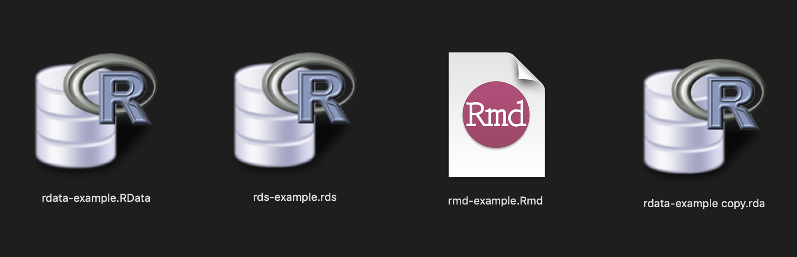
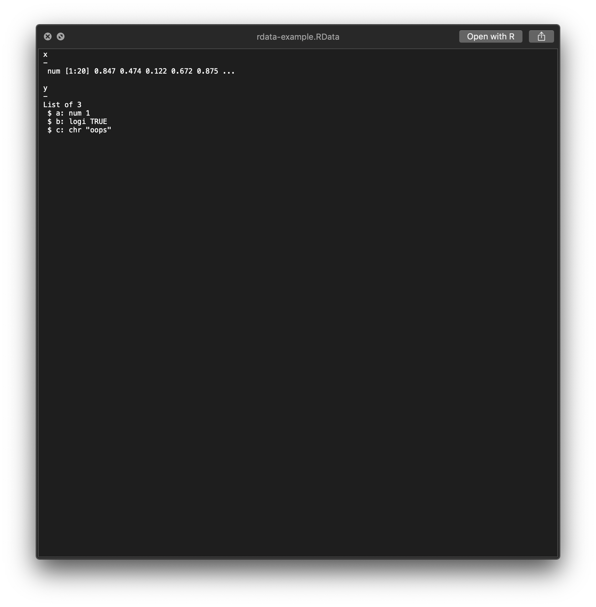
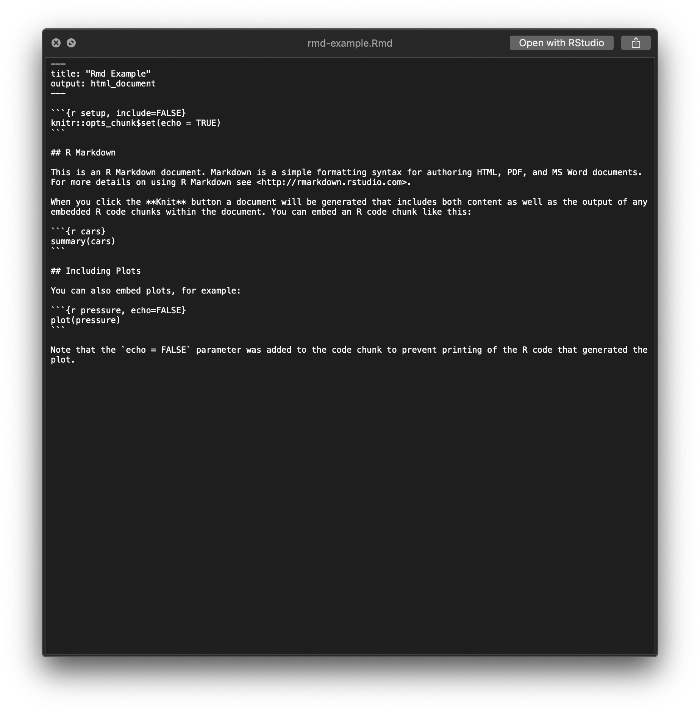

This is a macOS QuickLook Plugin for R data files.

That means if you install this plugin (download and unzip [`QuickLookR.qlgenerator.zip`](https://github.com/hrbrmstr/QuickLookR/releases/tag/v0.2.0) and put `QuickLookR.qlgenerator` into `~/Library/QuickLook`) you can hit the spacebar on an R Data or saved RDS file (case-insentitive `.rdata`, `.rda`, `.rds`, `.rmd` are currently supported extensions) and get a `str()` preview (for data files) without firing up R/RStudio and the ability to preview Rmd source files and then optionally go right to editing..

It looks for `Rscript` in `/usr/local/bin` and (for now) requires a helper package [`rdatainfo`](https://github.com/hrbrmstr/rdatainfo). `devtools::install_github("hrbrmstr/rdatainfo")` to install that.

For the moment, the QuickLook preview is rather plain, but I hope to improve the output and switch to reading the data files at the C-level by linking directly to `R.framework`.

